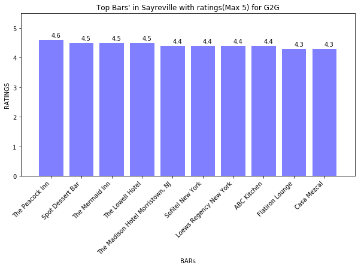
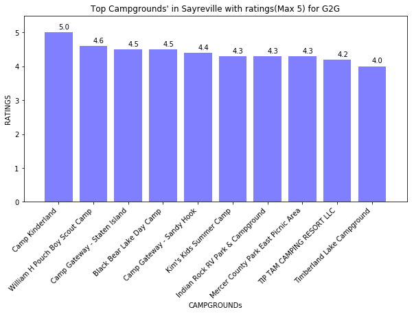
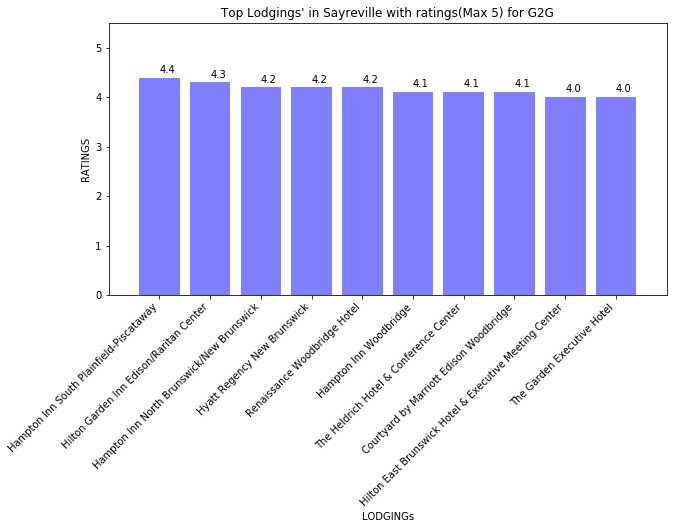
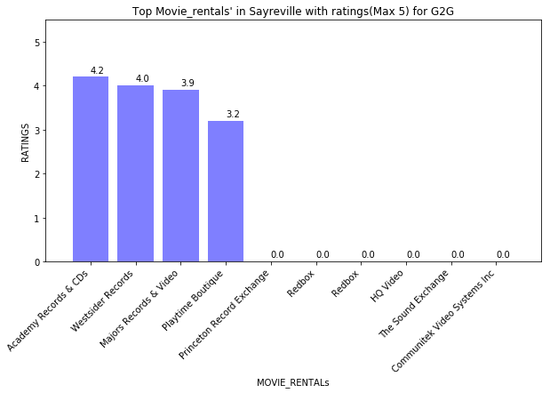
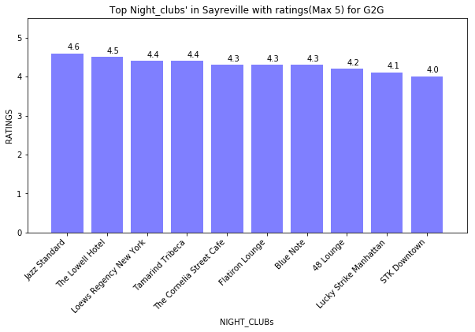
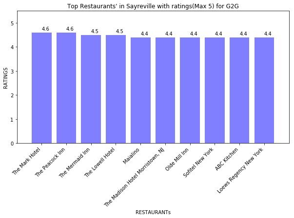
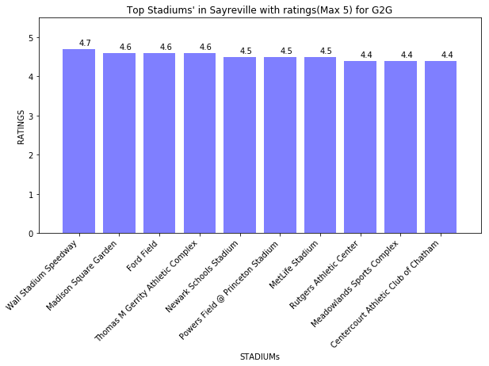

# Data_Destroyers
Project - Good Times to Go!!! (G2G)

1. Objective: The project, is developed in Python, focussed at recommending activities to people based on the current weather conditions for the given city,state. 

2. Xfactor: None of the applications that are currently present in the market considers the current weather condition in recommending the type of places or activities. Our project factors in the current weather and the time of the day to recommend the places and also provides the address and the ratings that are available on google.

3. PYTHON Modules used:
    a.openweathermapy.core
    b.pandas
    c.matplotlib
    d.numpy
    e.datetime
    f.json
    g.requests

4. APIs used:
    a. Openweather wrapper and the API key.
    b. Google APIs and the API key:
        i) https://maps.googleapis.com/maps/api/geocode/json?
        ii) https://maps.googleapis.com/maps/api/place/nearbysearch/json?
        iii) https://maps.googleapis.com/maps/api/place/findplacefromtext/json?
    c.Additional APIs that could be used:
        i)https://maps.googleapis.com/maps/api/place/details/json?
        ii)https://maps.googleapis.com/maps/api/distancematrix/json?

5. Source referred to get weather conditions and activity types are as below:
    a.Weather Conditions: https://openweathermap.org/weather-conditions
    b.Activity Types: https://developers.google.com/places/web-service/supported_types  

Note: Weather - Thunderstorm, Temperature, Windspeed, Humidity, Rain, Drizzle, Snow, Mist, Clear Sky are different factors to be considered under weather. The extreme weather like thunderstorms are considered as approriate for indoor activities whereas all other factors (excluding Temp, Windspped, Humidity) are evaluated based on further classification present in https://openweathermap.org/weather-conditions. For temperature & humidity, we took human sample of our family & fellow colleagues' experience to decide the appropriate range to go outdoor or remain indoor; For windspeed, we referred https://en.wikipedia.org/wiki/Beaufort_scale.

6. Limitations: 
    a. The places recommended are limited to what is present on the google data.
    b. The weather evaluation of is based on the human experience except for the extreme weather conditions &           windspeed.
    c. The project evaluates the current weather conditions and not the forecast.
    d. It does not factor in a person's past choices as the focus is on the current weather.
    e. It covers a hard coded radius not more than 50,000 meters.
    f. The project does not factor in age or personal choice and hence generic indoor & outdoor places are given.
    g. It does not calculate the distance to be covered or time to be taken to reach to the destination.
    h. It gives the open places and not the opening and closing time.
    i. Currently, the visualization is limited to the ratings comparison of various destinations of one kind.

 7. Future road to development:
    a. It would take the current location by default.
    b. The project would ask for the age and limit or recommend the kind of places.
    c. It would factor in the personal choices when type of places are chosen.
    d. It would give the distance to be covered and time to be taken to reach the destination, if a particular place        is chosen.
    e. It would give the opening & closing time. 
    f. The visualization for rating or distance or time taken to reach the destination would be displayed on the user's demand.

8. Code & output sample
import requests
import json
import datetime

import matplotlib.pyplot as plt
import pandas as pd
import numpy as np
import openweathermapy.core as owm

from config import api_key
from config import gkey

#Read all the Weather csv files 
main = "Resources/Indoor_Outdoor_Weather - main.csv"
main_df = pd.read_csv(main, encoding="ISO-8859-1")
Atmosphere = "Resources/Indoor_Outdoor_Weather - Atmosphere.csv"
atmosphere_df = pd.read_csv(Atmosphere, encoding="ISO-8859-1")
Drizzle= "Resources/Indoor_Outdoor_Weather - Drizzle.csv"
drizzle_df = pd.read_csv(Drizzle, encoding="ISO-8859-1")
Rain = "Resources/Indoor_Outdoor_Weather - Rain.csv"
rain_df = pd.read_csv(Rain, encoding="ISO-8859-1")
Snow ="Resources/Indoor_Outdoor_Weather - Snow.csv"
snow_df = pd.read_csv(Snow, encoding="ISO-8859-1")

#https://developers.google.com/places/web-service/supported_types
#Read all the activities files
Acty_In = pd.read_excel("Resources/Indoor.xlsx")
Acty_Out = pd.read_excel("Resources/Outdoor.xlsx")
Acty_EveIn = pd.read_excel("Resources/EveIndoor.xlsx")
Acty_EveInOut = pd.read_excel("Resources/EveInOut.xlsx")
Acty_NightIn = pd.read_excel("Resources/NightIndoor.xlsx")
Acty_NightInOut = pd.read_excel("Resources/NightInOut.xlsx")

#Converting the actvity dataframes into list
Acty_Inlist = Acty_In["Indoor"].tolist()
Acty_Outlist = Acty_Out["Outdoor"].tolist()
Acty_EveInlist = Acty_EveIn["EveIndoor"].tolist()
Acty_EveInOutlist = Acty_EveInOut["EveInOut"].tolist()
Acty_NightInlist = Acty_NightIn["NightIndoor"].tolist()
Acty_NightInOutlist = Acty_NightInOut["NightInOut"].tolist()

#Input the target city and state
Target_City = input("Enter city & state in the format 'city,state: ")

#Split the input to get the city
City = Target_City.split(",")[0]

#Create settings dictionary for units & appid
settings = {"units": "metric", "appid": api_key}

#Get current weather
current_weather = owm.get_current(City, **settings)

summary = ["name", 'weather', "main", "wind", 'clouds']
data = current_weather(*summary)

currentmain = data[1][0]["main"]
temp = data[2]['temp']
humidity = data[2]['humidity']
windspeed = data[3]["speed"]
currentdesc = data[1][0]['description']

Finalresult = ""
Words_of_advice = " "
 
# loop through main weather types to determine if outdoor or indoor activities
if (currentmain=="Thunderstorms") or (currentmain=="Clouds") or (currentmain=="Clear") or (currentmain=="Mist"):
    if (currentmain=="Thunderstorms"):
        Words_of_advice = "Staysafe!!! "+ currentmain + " in the " + City
        Finalresult="indoor"
        print(f'{Words_of_advice}: Be {Finalresult}')
    else:
        Finalresult="outdoor"
        print(f"It seems to be fine outdoor, however, let's evaluate temp, windspeed and humidity further to confirm if we should be {Finalresult}s")
else:
    if currentmain=="Rain":
    #read rain.df to find further details
        for index, desctype in rain_df.iterrows():
            if currentdesc == desctype["Description"]:
                Finalresult=rain_df["Rating"][index]
                print(f'{currentmain}:{currentdesc}: You can be {Finalresult}')
    elif currentmain=="Snow" :
        #read snow.df to find further details
        for index, desctype in snow_df.iterrows():
            if currentdesc == desctype["Description"]:
                Finalresult=desctype["Rating"][index]
                print(f'{currentmain}:{currentdesc}: You can be {Finalresult}')
    elif currentmain=="Drizzle" :
        #read drizzledf to find further details
        for index, desctype in drizzle_df.iterrrows():
            if currentdesc == desctype["Description"]:
                Finalresult=drizzle_df["Rating"][index]
                print(f'{currentmain}:{currentdesc}: You can be {Finalresult}')
    elif currentmain=="Atmosphere" :
        #read atmospheredf to find further details
        for index, desctype in atmosphere_df.iterrows():
            if currentdesc== desctype["Description"]:
                Finalresult=atmosphere_df["Rating"][index]
                print(f'{currentmain}:{currentdesc}: You can be {Finalresult}')
if Finalresult == "outdoor" or " ":
    if  (temp<7 or temp>35):
        Words_of_advice = "Better to be safe inside as it is extreme temperature" + str(temp) + " outside in " + City
        Finalresult="indoor"
        print(f'{Words_of_advice}: Advisable to be {Finalresult}')
    elif(windspeed>38):
        #https://en.wikipedia.org/wiki/Beaufort_scale
        Words_of_advice = "Better to be safe inside as it is windy " + str(windspeed) + " outside in " + City
        Finalresult="indoor"
        print(f'{Words_of_advice}: Advisable to be {Finalresult}')
    elif(humidity>60): 
        Words_of_advice  = "Better to be inside as it is quite humid " + str(humidity) + " outside in " + City
        Finalresult="indoor" 
        print(f'{Words_of_advice}: Advisable to be {Finalresult}')
    else:
        Words_of_advice = "It is safe & pleasant!!! Enjoy outside in the current weather of "+ currentmain +" in "+ City
        Finalresult="outdoor"
        print(f'{Words_of_advice}: Be {Finalresult}s & have fun!!!')

now = datetime.datetime.now()
print(now)
At12= now.replace(hour=12, minute=0, second=0, microsecond=0)
At15 = now.replace(hour=15, minute=0, second=0, microsecond=0)
At18 = now.replace(hour=18, minute=0, second=0, microsecond=0)
At21 = now.replace(hour=21, minute=0, second=0, microsecond=0)

Acty = Finalresult
if (Acty == "outdoor"):
    if(now < At12):
        #print(Words_of_advice)
        print("It's morning, plan outdoor activities for the entire day")
        Acty = Acty_Outlist
    elif((now >= At12 and now < At15)):
        #print(Words_of_advice)
        print("It's afternoon, plan outdoor activities for the day")
        Acty = Acty_Outlist
    elif((now >= At15 and now < At18)):
        #print(Words_of_advice)
        print("It's evening, though you can go outdoor,however, we would suggest indoor activities for the evening as parks,zoos might be closed. We would add stadiums though, as there might be matches and campgrounds if you are adventurous!!!")
        Acty = Acty_EveInOutlist
    elif((now >= At18)):
        #print(Words_of_advice)
        print("It's lovely night, though you can go outdoor,however, we would recommend indoor activities for the night,as parks,zoos are closed. We would add stadiums though, as there might be matches and campgrounds if you are adventurous!!!")
        Acty = Acty_NightInOutlist 
elif (Acty == "indoor"):        
    if(now < At12):
        #print(Words_of_advice)
        print("It's morning, plan indoor activities for the entire day or stay at home & relax.")
        Acty = Acty_Inlist
    elif((now >= At12 and now < At15)):
        #print(Words_of_advice)
        print("It's afternoon, plan indoor activities for the day or stay at home & relax.")
        Acty = Acty_Inlist
    elif((now >= At15 and now < At18)):
        #print(Words_of_advice)
        print("It's evening, plan indoor activities for the evening or stay at home & relax.")
        Acty = Acty_EveInlist 
    elif((now >= At18)):
        #print(Words_of_advice)
        print("It's night, plan indoor activities for the night or stay at home & relax.")
        Acty = Acty_NightInlist 

#Google Maps Geocode API
base_url_geocode = "https://maps.googleapis.com/maps/api/geocode/json"

#Creating the params dict with address and key
params_geocode = {"address": Target_City, "key": gkey}

# Run request (Build URL using the base_url & params)
response = requests.get(base_url_geocode, params=params_geocode)

# Convert the response to JSON
city_geo = response.json()

# Extract Lat/Lng
lat = city_geo["results"][0]["geometry"]["location"]["lat"]
lng = city_geo["results"][0]["geometry"]["location"]["lng"]

# Print results
print("%s: %s, %s" % (Target_City, lat, lng))

#Converting the lat & lng to string
lat = str(lat)
lng = str(lng)

#Google maps nearby places search API
base_url_nearby = "https://maps.googleapis.com/maps/api/place/nearbysearch/json?"
#Google maps places API
base_url_findplace = "https://maps.googleapis.com/maps/api/place/findplacefromtext/json?"

#Find the names and addresses of nearbyplaces in given city,state entered by the
#user.
type_of_place = []
place_names = []
addresses = []
rating = []
openorclose = []
for i in range(len(Acty)):
    
    target_type = Acty[i]
    radius = 50000

# Build URL using the Google Maps API and other fields
    target_url_nearby = base_url_nearby+"key="+gkey+"&location="+lat+","+lng+"&radius="+str(radius)+"&type="+target_type
    #target_url_nearby = base_url_nearby+"key="+gkey+"&location="+lat+","+lng+"&rankby=distance"+"&type="+target_type

# Run request
    response = requests.get(target_url_nearby)
    city_placestogo = response.json()
   
    if city_placestogo["status"] == "ZERO_RESULTS":
        print(f'{Acty[i].upper()} : No {Acty[i]} near your place of choice.')
        type_of_place.append(target_type)
        place_names.append("")
        addresses.append("")
        rating.append("")
        openorclose.append("")
        print("\n")
    else:
        print(f'{Acty[i].upper()} : Bingo!!! We have found good {Acty[i]}s near your place of choice.')
        count = 0
        for item in city_placestogo["results"]:
            myplace = item["name"]
            myplace = myplace.replace(" ", "%20")
            target_url_findplace = base_url_findplace+"key="+gkey+"&input="+myplace+"&inputtype=textquery"+"&fields=formatted_address,name,rating,opening_hours"
            response = requests.get(target_url_findplace)
            data = response.json()
            type_of_place.append(target_type)
            try:
                place_names.append(data["candidates"][0]["name"])
            except:
                place_names.append(item["name"])
            try:    
                addresses.append(data["candidates"][0]["formatted_address"])
            except:
                addresses.append(item["vicinity"])
            try:    
                rating.append(data["candidates"][0]["rating"])
            except:   
                rating.append(np.nan)
            try:  
                if(data["candidates"][0]["opening_hours"]["open_now"]):
                    openorclose_status = "Open"
                else:
                    openorclose_status = "Closed"
                openorclose.append(openorclose_status)
            except:
                openorclose.append("Check the opening hours on the website")
            count = count + 1
        print(f'Total {count} {Acty[i]}s are found near {City}')
        print("\n")    

Df = pd.DataFrame({"Type":type_of_place,"Place":place_names,"Address":addresses, 
                   "Rating":rating,
                  "OpenorClose":openorclose})
Df.fillna(0, inplace=True)
Df[["Type","Place","Address","Rating","OpenorClose"]]

for acty in Acty:
    print(acty.upper())
    Df_A = Df[Df["Type"] == acty]
    if (Df_A["Place"].any() == ""):
            print(f'No {acty} near your place of choice.')
    else:    
        Df_A = Df_A.sort_values(by=["Rating"],ascending=False)
        DF_A = Df_A[Df_A["OpenorClose"]=="Open"]
        Df_A = Df_A[:10]
        x_axis = np.arange(len(Df_A["Place"]))
        plt.figure(figsize = (10,5))
        plt.bar(x_axis, Df_A["Rating"],align="center",color="blue",alpha = 0.5)
        plt.xlim(-1,10)
        plt.ylim(0,5.5)
        plt.xlabel(f'{acty.upper()}s')
        plt.ylabel("Ratings".upper())
        plt.title(f"Top {acty.capitalize()}s' in {City} with ratings(Max 5) for G2G")
        plt.xticks(x_axis, Df_A["Place"],rotation=45,horizontalalignment="right")
        for a,b in zip(x_axis, Df_A["Rating"]):
            plt.text(a, b+.1, str(b))    
        plt.savefig(f'Results/Top_{acty.capitalize()}s_of_{City}_with_Ratings_G2G_Radius_Open.jpg',bbox_inches="tight")
        plt.show()    
```
Input:
    Enter city & state in the format 'city,state: Sayreville, NJ
Sample Output:    
    Rain:light rain: You can be outdoor
    It is safe & pleasant!!! Enjoy outside in the current weather of Rain in Sayreville: Be outdoors & have fun!!!
    2018-07-20 21:00:03.172508
    It's lovely night, though you can go outdoor,however, we would recommend indoor activities for the night,as parks,zoos are closed. We would add stadiums though, as there might be matches and campgrounds if you are adventurous!!!
    Sayreville, NJ: 40.45940210000001, -74.360846
    BAR : Bingo!!! We have found good bars near your place of choice.
    Total 20 bars are found near Sayreville
    
    
    CAMPGROUND : Bingo!!! We have found good campgrounds near your place of choice.
    Total 20 campgrounds are found near Sayreville
    
    
    CASINO : Bingo!!! We have found good casinos near your place of choice.
    Total 18 casinos are found near Sayreville
    
    
    LODGING : Bingo!!! We have found good lodgings near your place of choice.
    Total 20 lodgings are found near Sayreville
    
    
    MOVIE_RENTAL : Bingo!!! We have found good movie_rentals near your place of choice.
    Total 20 movie_rentals are found near Sayreville
    
    
    MOVIE_THEATER : Bingo!!! We have found good movie_theaters near your place of choice.
    Total 20 movie_theaters are found near Sayreville
    
    
    NIGHT_CLUB : Bingo!!! We have found good night_clubs near your place of choice.
    Total 20 night_clubs are found near Sayreville
    
    
    RESTAURANT : Bingo!!! We have found good restaurants near your place of choice.
    Total 20 restaurants are found near Sayreville
    
    
    STADIUM : Bingo!!! We have found good stadiums near your place of choice.
    Total 20 stadiums are found near Sayreville
    
    
    BAR
    





    CAMPGROUND
    





    CASINO
    


    LODGING
    





    MOVIE_RENTAL
    





    MOVIE_THEATER
    


    NIGHT_CLUB
    





    RESTAURANT
    





    STADIUM
    



    

